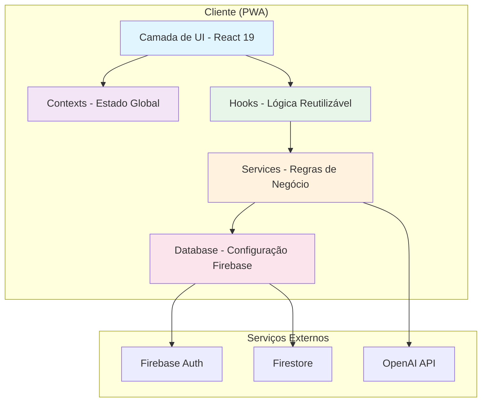
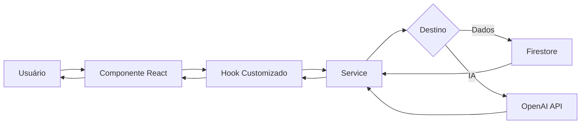
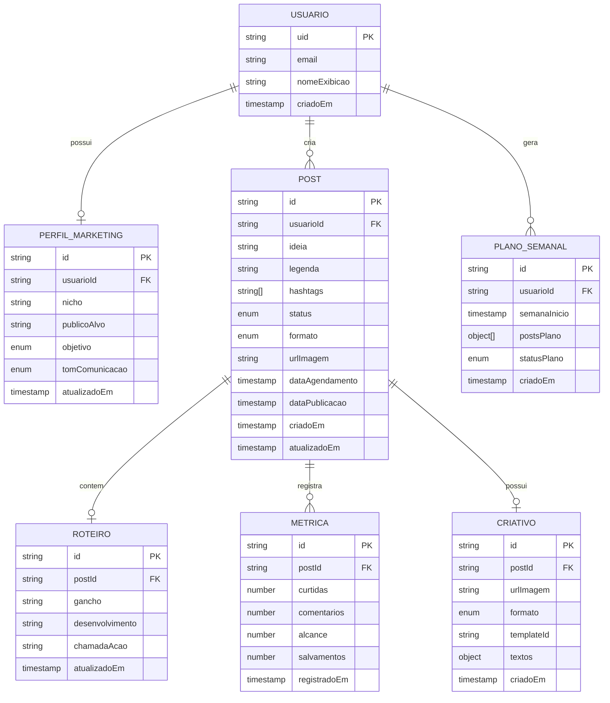
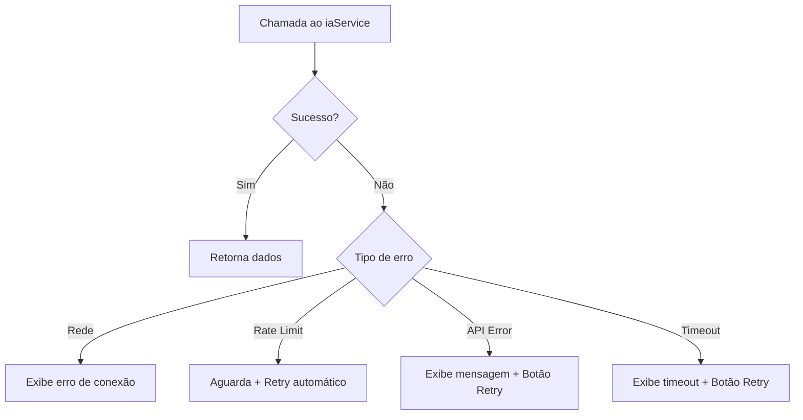

# Documento de Design — InstaFlow: PWA de Marketing para Instagram com IA

## Visão Geral

O InstaFlow é uma PWA construída com React 19 + TypeScript + Vite que permite a criação, organização e publicação assistida de conteúdo para Instagram utilizando inteligência artificial. A arquitetura é inteiramente frontend, consumindo Firebase (Firestore + Auth) como backend-as-a-service e a API da OpenAI diretamente do cliente.

### Decisões Arquiteturais Principais

- **Sem backend próprio**: Toda lógica reside no frontend. Firebase Rules garantem segurança dos dados.
- **Consumo direto da OpenAI**: A chave da API é armazenada em variável de ambiente e utilizada via chamadas HTTPS do cliente.
- **PWA com Service Worker**: Cache de assets estáticos e dados previamente carregados para funcionamento offline.
- **Mobile-first**: Interface otimizada para dispositivos móveis com breakpoints responsivos.
- **Nomenclatura em português**: Todo código segue convenção de nomes em português brasileiro.

---

## Arquitetura

### Diagrama de Arquitetura de Alto Nível



### Diagrama de Fluxo de Dados



### Camadas da Aplicação

| Camada | Responsabilidade | Pasta |
|--------|-----------------|-------|
| Apresentação | Componentes visuais, páginas, rotas | `components/`, `pages/`, `routes/` |
| Estado | Gerenciamento de estado global | `contexts/` |
| Lógica | Hooks reutilizáveis, orquestração | `hooks/` |
| Negócio | Services com regras de negócio e chamadas externas | `services/` |
| Dados | Configuração e acesso ao Firebase | `database/` |
| Suporte | Tipos, utilitários, assets | `types/`, `utils/`, `assets/` |

---

## Componentes e Interfaces

### Páginas (pages/)

| Página | Descrição |
|--------|-----------|
| `PaginaLogin` | Tela de autenticação (e-mail/senha + Google) |
| `PaginaCadastro` | Tela de registro de novo usuário |
| `PaginaPrincipal` | Dashboard com resumo e acesso rápido |
| `PaginaPerfil` | Configuração do perfil de marketing |
| `PaginaIdeias` | Geração e listagem de ideias de posts |
| `PaginaPost` | Criação/edição de post (legenda, hashtags, roteiro) |
| `PaginaCriativos` | Geração de imagens e edição de templates |
| `PaginaCalendario` | Visualização e organização de posts no calendário |
| `PaginaPublicacao` | Tela de publicação assistida |
| `PaginaMetricas` | Registro e visualização de métricas |
| `PaginaAnalise` | Painel de análise e sugestões de melhoria |
| `PaginaModoGrowth` | Geração de plano semanal automático |

### Componentes Reutilizáveis (components/)

| Componente | Descrição |
|------------|-----------|
| `BotaoAcao` | Botão genérico com variantes (primário, secundário, perigo) |
| `CampoTexto` | Input de texto com label e validação |
| `SeletorTom` | Seletor de tom de comunicação |
| `ListaHashtags` | Exibição de hashtags como tags selecionáveis |
| `CartaoPost` | Card de resumo de um post |
| `EditorLegenda` | Campo editável para legendas |
| `EditorRoteiro` | Editor de roteiro em seções |
| `EditorTemplate` | Editor visual de templates com texto/CTA |
| `PreVisualizacaoPost` | Pré-visualização completa do post |
| `IndicadorStatus` | Badge visual de status do post |
| `IndicadorSalvamento` | Indicador de salvamento automático |
| `IndicadorOffline` | Banner de estado offline |
| `GraficoDesempenho` | Gráfico comparativo de métricas |
| `CalendarioMensal` | Componente de calendário com drag-and-drop |
| `MenuNavegacao` | Menu inferior para mobile / sidebar para desktop |
| `ModalConfirmacao` | Modal genérico de confirmação |
| `CarregandoSpinner` | Indicador de carregamento |
| `MensagemErro` | Componente de exibição de erros com retry |

### Contexts (contexts/)

| Context | Responsabilidade |
|---------|-----------------|
| `ContextoAutenticacao` | Estado do usuário autenticado, login/logout |
| `ContextoPerfil` | Dados do perfil de marketing do usuário |
| `ContextoPosts` | Lista de posts, CRUD, filtros por status |
| `ContextoConexao` | Estado de conexão (online/offline) |

### Hooks (hooks/)

| Hook | Responsabilidade |
|------|-----------------|
| `useAutenticacao` | Lógica de login, logout, registro |
| `usePerfilMarketing` | CRUD do perfil de marketing |
| `usePosts` | CRUD de posts, filtros, ordenação |
| `useGeracaoIA` | Orquestração de chamadas à OpenAI |
| `useCalendario` | Lógica do calendário (navegação, drag-and-drop) |
| `useMetricas` | Registro e consulta de métricas |
| `useSalvamentoAutomatico` | Debounce de 2s + persistência |
| `useConexao` | Detecção de estado online/offline |
| `useSincronizacao` | Sincronização de dados offline → Firestore |
| `useModoGrowth` | Geração e gerenciamento do plano semanal |

### Services (services/)

| Service | Métodos Principais |
|---------|-------------------|
| `autenticacaoService` | `loginComEmail`, `loginComGoogle`, `registrar`, `sair` |
| `perfilService` | `obterPerfil`, `salvarPerfil`, `atualizarPerfil` |
| `postService` | `criarPost`, `atualizarPost`, `listarPosts`, `excluirPost`, `alterarStatus` |
| `iaService` | `gerarIdeias`, `gerarLegenda`, `gerarHashtags`, `gerarRoteiro`, `gerarVariacoes`, `gerarPlanoSemanal`, `analisarDesempenho`, `sugerirHorarios` |
| `imagemService` | `gerarImagem`, `obterFormatos` |
| `metricaService` | `registrarMetrica`, `atualizarMetrica`, `obterMetricasPorPost`, `obterResumoMetricas` |
| `sincronizacaoService` | `sincronizarDadosOffline`, `armazenarLocal`, `obterDadosLocais` |

### Interfaces dos Services

```typescript
// services/iaService.ts
interface ConfiguracaoGeracaoIA {
  nicho: string
  publicoAlvo: string
  objetivo: ObjetivoMarketing
  tomComunicacao: TomComunicacao
}

interface RespostaIA<T> {
  sucesso: boolean
  dados?: T
  erro?: string
}

const iaService = {
  gerarIdeias: (config: ConfiguracaoGeracaoIA): Promise<RespostaIA<string[]>>
  gerarLegenda: (config: ConfiguracaoGeracaoIA, ideia: string): Promise<RespostaIA<string>>
  gerarHashtags: (config: ConfiguracaoGeracaoIA, conteudo: string): Promise<RespostaIA<HashtagSugerida[]>>
  gerarRoteiro: (config: ConfiguracaoGeracaoIA, ideia: string): Promise<RespostaIA<Roteiro>>
  gerarVariacoes: (config: ConfiguracaoGeracaoIA, ideia: string): Promise<RespostaIA<VariacaoConteudo[]>>
  gerarPlanoSemanal: (config: ConfiguracaoGeracaoIA): Promise<RespostaIA<PlanoSemanal>>
  analisarDesempenho: (config: ConfiguracaoGeracaoIA, metricas: Metrica[]): Promise<RespostaIA<SugestaoMelhoria[]>>
  sugerirHorarios: (config: ConfiguracaoGeracaoIA, metricas: Metrica[]): Promise<RespostaIA<HorarioSugerido[]>>
}
```

---

## Modelos de Dados

### Diagrama de Entidades



### Tipos TypeScript (types/)

```typescript
// types/usuario.ts
interface Usuario {
  uid: string
  email: string
  nomeExibicao: string
  criadoEm: Timestamp
}

// types/perfilMarketing.ts
type ObjetivoMarketing = 'vendas' | 'engajamento' | 'leads'
type TomComunicacao = 'formal' | 'vendas' | 'descontrado'

interface PerfilMarketing {
  id: string
  usuarioId: string
  nicho: string
  publicoAlvo: string
  objetivo: ObjetivoMarketing
  tomComunicacao: TomComunicacao
  atualizadoEm: Timestamp
}

// types/post.ts
type StatusPost = 'rascunho' | 'agendado' | 'publicado'
type FormatoPost = 'post' | 'story' | 'reel'

interface Post {
  id: string
  usuarioId: string
  ideia: string
  legenda: string
  hashtags: string[]
  status: StatusPost
  formato: FormatoPost
  urlImagem: string | null
  dataAgendamento: Timestamp | null
  dataPublicacao: Timestamp | null
  criadoEm: Timestamp
  atualizadoEm: Timestamp
}

// types/roteiro.ts
interface Roteiro {
  id: string
  postId: string
  gancho: string
  desenvolvimento: string
  chamadaAcao: string
  atualizadoEm: Timestamp
}

// types/metrica.ts
interface Metrica {
  id: string
  postId: string
  curtidas: number
  comentarios: number
  alcance: number
  salvamentos: number
  registradoEm: Timestamp
}

// types/criativo.ts
type FormatoCriativo = '1080x1080' | '1080x1920'

interface Criativo {
  id: string
  postId: string
  urlImagem: string
  formato: FormatoCriativo
  templateId: string | null
  textos: Record<string, string>
  criadoEm: Timestamp
}

// types/planoSemanal.ts
type StatusPlano = 'gerado' | 'aprovado' | 'parcial'

interface PostPlano {
  diaSemana: number
  ideia: string
  legenda: string
  hashtags: string[]
  horarioSugerido: string
  aprovado: boolean
}

interface PlanoSemanal {
  id: string
  usuarioId: string
  semanaInicio: Timestamp
  postsPlano: PostPlano[]
  statusPlano: StatusPlano
  criadoEm: Timestamp
}

// types/hashtag.ts
type RelevanciaHashtag = 'alta' | 'media' | 'baixa'

interface HashtagSugerida {
  texto: string
  relevancia: RelevanciaHashtag
}

// types/ia.ts
interface VariacaoConteudo {
  formato: FormatoPost
  legenda: string
  hashtags: string[]
}

interface SugestaoMelhoria {
  categoria: string
  descricao: string
  prioridade: 'alta' | 'media' | 'baixa'
}

interface HorarioSugerido {
  diaSemana: number
  horario: string
  confianca: number
}
```

### Estrutura Firestore

```
/usuarios/{uid}/
  perfil/          → documento único com PerfilMarketing
  posts/{postId}   → documentos de Post
  roteiros/{id}    → documentos de Roteiro (postId como campo)
  metricas/{id}    → documentos de Metrica (postId como campo)
  criativos/{id}   → documentos de Criativo (postId como campo)
  planos/{id}      → documentos de PlanoSemanal
```

### Regras de Segurança Firestore

```javascript
rules_version = '2';
service cloud.firestore {
  match /databases/{database}/documents {
    match /usuarios/{uid}/{document=**} {
      allow read, write: if request.auth != null && request.auth.uid == uid;
    }
  }
}
```


---

## Propriedades de Corretude

*Uma propriedade é uma característica ou comportamento que deve ser verdadeiro em todas as execuções válidas de um sistema — essencialmente, uma declaração formal sobre o que o sistema deve fazer. Propriedades servem como ponte entre especificações legíveis por humanos e garantias de corretude verificáveis por máquina.*

### Propriedade 1: Proteção de rotas para usuários não autenticados

*Para qualquer* rota protegida do sistema e qualquer estado onde o usuário não está autenticado, acessar essa rota deve resultar em redirecionamento para a tela de login, sem exibir conteúdo da rota protegida.

**Valida: Requisitos 1.7**

### Propriedade 2: Mapeamento de erros de autenticação

*Para qualquer* código de erro retornado pelo Firebase Auth, o sistema deve mapear esse código para uma mensagem de erro descritiva em português, nunca exibindo códigos técnicos diretamente ao usuário.

**Valida: Requisitos 1.3**

### Propriedade 3: Validação de campos obrigatórios em formulários

*Para qualquer* combinação de campos obrigatórios vazios (string vazia ou apenas espaços) em formulários do sistema (perfil de marketing, métricas), o sistema deve rejeitar a submissão e exibir mensagens de validação para cada campo vazio, sem alterar os dados persistidos.

**Valida: Requisitos 2.4, 15.4**

### Propriedade 4: Contexto do perfil em todas as gerações de IA

*Para qualquer* chamada de geração de conteúdo ao iaService (ideias, legendas, hashtags, roteiros, variações, plano semanal), o prompt enviado à API da OpenAI deve conter o nicho, público-alvo, objetivo e tom de comunicação do perfil do usuário.

**Valida: Requisitos 2.5, 3.1, 4.1, 5.1, 13.5**

### Propriedade 5: Tratamento de erros em chamadas à API da OpenAI

*Para qualquer* chamada ao iaService ou imagemService que resulte em erro (timeout, rate limit, erro de rede, erro de API), o sistema deve retornar um objeto de erro com mensagem descritiva e o componente deve oferecer a opção de nova tentativa, sem alterar o estado anterior.

**Valida: Requisitos 3.4, 4.5, 6.4, 7.4, 14.4**

### Propriedade 6: Persistência e recuperação de dados (round-trip)

*Para qualquer* entidade do sistema (Post, Roteiro, Criativo, Metrica, PerfilMarketing, PlanoSemanal), salvar a entidade no Firestore e em seguida recuperá-la deve produzir um objeto equivalente ao original, com todos os campos preservados.

**Valida: Requisitos 2.2, 5.3, 6.3, 7.5, 8.4, 10.5, 15.2, 15.3**

### Propriedade 7: Máquina de estados do Post

*Para qualquer* Post, as seguintes transições de estado devem ser respeitadas: (1) um novo Post sempre inicia com status "rascunho"; (2) ao definir uma data de agendamento em um Post "rascunho", o status deve mudar para "agendado"; (3) ao marcar como publicado, o status deve mudar para "publicado" e a data de publicação deve ser registrada. Nenhuma transição inválida deve ser permitida.

**Valida: Requisitos 10.1, 10.2, 10.3, 11.5**

### Propriedade 8: Filtragem de posts por status

*Para qualquer* filtro de StatusPost aplicado (rascunho, agendado, publicado) sobre uma lista de posts, todos os posts retornados devem possuir exclusivamente o status filtrado, e nenhum post com status diferente deve aparecer no resultado.

**Valida: Requisitos 10.4**

### Propriedade 9: Conteúdo copiado para área de transferência

*Para qualquer* Post com legenda e hashtags, ao executar a ação de copiar legenda, o texto copiado para a área de transferência deve conter a legenda completa seguida de todas as hashtags associadas ao post.

**Valida: Requisitos 11.2**

### Propriedade 10: Sugestão de horários com e sem métricas

*Para qualquer* usuário, se existem métricas registradas para posts anteriores, o sistema deve analisar essas métricas para sugerir horários; se não existem métricas suficientes, o sistema deve retornar horários padrão baseados no nicho do perfil. Em ambos os casos, a resposta deve conter pelo menos um horário sugerido válido.

**Valida: Requisitos 12.1, 12.2**

### Propriedade 11: Estrutura completa do Plano Semanal

*Para qualquer* Plano Semanal gerado pelo Modo Growth, o plano deve conter exatamente 7 entradas (uma por dia da semana), e cada entrada deve possuir: ideia não vazia, legenda não vazia, pelo menos uma hashtag, e horário sugerido válido.

**Valida: Requisitos 13.1**

### Propriedade 12: Aprovação do Plano Semanal cria posts agendados

*Para qualquer* Plano Semanal aprovado pelo usuário, o sistema deve criar um Post individual no Firestore para cada entrada aprovada do plano, com Status_Post "agendado" e a data correspondente ao dia da semana.

**Valida: Requisitos 13.3**

### Propriedade 13: Expansão de ideia gera variações em múltiplos formatos

*Para qualquer* ideia expandida, o sistema deve gerar variações que cubram pelo menos dois formatos diferentes (post, story, reel), e cada variação deve conter legenda não vazia, pelo menos uma hashtag, e formato definido.

**Valida: Requisitos 14.1, 14.2**

### Propriedade 14: Criação de posts a partir de variações selecionadas

*Para qualquer* seleção de N variações de conteúdo pelo usuário, o sistema deve criar exatamente N posts individuais no Firestore, cada um com os dados da variação correspondente.

**Valida: Requisitos 14.3**

### Propriedade 15: Cálculo de médias de engajamento

*Para qualquer* conjunto de 3 ou mais métricas registradas, o sistema deve calcular corretamente as médias de curtidas, comentários, alcance e salvamentos (soma dos valores dividida pelo número de métricas).

**Valida: Requisitos 16.1**

### Propriedade 16: Debounce de salvamento automático

*Para qualquer* sequência de edições feitas pelo usuário com intervalo menor que 2 segundos entre elas, o sistema deve executar apenas uma operação de salvamento após 2 segundos de inatividade, não uma para cada edição individual.

**Valida: Requisitos 17.1**

### Propriedade 17: Sincronização offline (round-trip)

*Para qualquer* alteração feita pelo usuário enquanto offline, o sistema deve armazenar a alteração localmente; quando a conexão é restabelecida, o sistema deve sincronizar automaticamente com o Firestore, e os dados recuperados após sincronização devem ser equivalentes aos editados offline.

**Valida: Requisitos 17.3, 18.3, 18.4**

### Propriedade 18: Isolamento de dados por usuário

*Para qualquer* operação de leitura ou escrita no Firestore, o caminho do documento deve incluir o identificador (uid) do usuário autenticado, garantindo que nenhum usuário acesse dados de outro.

**Valida: Requisitos 17.4**

### Propriedade 19: Formato do criativo corresponde à seleção

*Para qualquer* seleção de formato de criativo (1080x1080, 1080x1920), a requisição enviada à API de geração de imagem deve utilizar as dimensões correspondentes ao formato selecionado.

**Valida: Requisitos 7.3**

### Propriedade 20: Calendário exibe posts nas datas corretas com indicadores de status

*Para qualquer* conjunto de posts com datas de agendamento e status definidos, o calendário deve posicionar cada post na data correta e exibir um indicador visual distinto para cada status (rascunho, agendado, publicado).

**Valida: Requisitos 9.1, 9.4**

### Propriedade 21: Drag-and-drop no calendário atualiza data

*Para qualquer* Post movido de uma data para outra no calendário via drag-and-drop, a data de agendamento do Post deve ser atualizada para a nova data no Firestore.

**Valida: Requisitos 9.3**

### Propriedade 22: Estrutura do roteiro gerado

*Para qualquer* roteiro gerado pelo iaService, o resultado deve conter exatamente três seções não vazias: gancho, desenvolvimento e chamadaAcao.

**Valida: Requisitos 6.1**

### Propriedade 23: Hashtags categorizadas por relevância

*Para qualquer* lista de hashtags gerada pelo iaService, cada hashtag deve possuir uma categoria de relevância válida (alta, média ou baixa).

**Valida: Requisitos 5.4**

### Propriedade 24: Exibição do formulário de métricas apenas para posts publicados

*Para qualquer* Post acessado pelo usuário, o formulário de registro de métricas deve ser exibido se e somente se o Status_Post for "publicado".

**Valida: Requisitos 15.1**

### Propriedade 25: Mensagem de métricas insuficientes

*Para qualquer* usuário com menos de 3 métricas registradas que solicita análise de desempenho, o sistema deve exibir uma mensagem orientando o registro de métricas, sem tentar gerar análise.

**Valida: Requisitos 16.4**

---

## Tratamento de Erros

### Estratégia Geral

| Camada | Estratégia |
|--------|-----------|
| Services | Retornam `RespostaIA<T>` com campo `sucesso` e `erro`. Nunca lançam exceções não tratadas. |
| Hooks | Capturam erros dos services e expõem estado de erro para os componentes. |
| Componentes | Exibem `MensagemErro` com descrição e botão de retry quando aplicável. |

### Categorias de Erro

| Categoria | Tratamento |
|-----------|-----------|
| Erro de rede / conexão | Armazenar localmente, exibir indicador offline, sincronizar ao reconectar |
| Erro de API OpenAI (rate limit, timeout) | Exibir mensagem descritiva, oferecer retry com backoff exponencial |
| Erro de autenticação Firebase | Mapear código para mensagem em português, exibir no formulário |
| Erro de validação de formulário | Exibir mensagens inline nos campos inválidos, impedir submissão |
| Erro de permissão Firestore | Redirecionar para login (sessão expirada) |
| Erro de geração de imagem | Exibir mensagem, oferecer retry ou seleção de template alternativo |

### Mapeamento de Erros Firebase Auth

```typescript
const mapaErrosAutenticacao: Record<string, string> = {
  'auth/user-not-found': 'Usuário não encontrado. Verifique o e-mail informado.',
  'auth/wrong-password': 'Senha incorreta. Tente novamente.',
  'auth/email-already-in-use': 'Este e-mail já está cadastrado.',
  'auth/weak-password': 'A senha deve ter pelo menos 6 caracteres.',
  'auth/invalid-email': 'E-mail inválido. Verifique o formato.',
  'auth/too-many-requests': 'Muitas tentativas. Aguarde alguns minutos.',
  'auth/network-request-failed': 'Erro de conexão. Verifique sua internet.',
}
```

### Fluxo de Erro em Chamadas IA



---

## Estratégia de Testes

### Abordagem Dual: Testes Unitários + Testes de Propriedade

O projeto utiliza uma abordagem complementar de testes:

- **Testes unitários**: Verificam exemplos específicos, edge cases e condições de erro
- **Testes de propriedade**: Verificam propriedades universais em múltiplas entradas geradas aleatoriamente

### Ferramentas

| Ferramenta | Propósito |
|-----------|-----------|
| Vitest | Framework de testes unitários |
| fast-check | Biblioteca de testes baseados em propriedades |
| @testing-library/react | Testes de componentes React |
| msw (Mock Service Worker) | Mock de APIs externas (OpenAI, Firebase) |

### Configuração de Testes de Propriedade

- Biblioteca: **fast-check** (compatível com Vitest)
- Mínimo de **100 iterações** por teste de propriedade
- Cada teste deve referenciar a propriedade do design com comentário no formato:
  - `// Feature: instagram-ai-marketing-pwa, Property {número}: {título}`

### Testes Unitários — Foco

- Exemplos específicos de fluxos de autenticação (login com Google, cadastro)
- Edge cases de formulários (campos vazios, caracteres especiais)
- Renderização correta de componentes em estados específicos
- Integração entre hooks e services (com mocks)
- Comportamento do Service Worker e cache

### Testes de Propriedade — Foco

Cada propriedade de corretude (1-25) deve ser implementada por um **único teste de propriedade** utilizando fast-check:

- **Propriedade 1**: Gerar rotas protegidas aleatórias, verificar redirecionamento sem auth
- **Propriedade 2**: Gerar códigos de erro Firebase aleatórios, verificar mapeamento para mensagem
- **Propriedade 3**: Gerar combinações de campos vazios/preenchidos, verificar validação
- **Propriedade 4**: Gerar perfis aleatórios, verificar inclusão no prompt
- **Propriedade 5**: Gerar tipos de erro aleatórios, verificar tratamento uniforme
- **Propriedade 6**: Gerar entidades aleatórias, verificar round-trip save/load
- **Propriedade 7**: Gerar sequências de transições de estado, verificar máquina de estados
- **Propriedade 8**: Gerar listas de posts com status variados, verificar filtragem
- **Propriedade 9**: Gerar posts com legendas e hashtags aleatórias, verificar conteúdo copiado
- **Propriedade 10**: Gerar cenários com/sem métricas, verificar resposta de horários
- **Propriedade 11**: Gerar planos semanais, verificar estrutura completa
- **Propriedade 12**: Gerar planos aprovados, verificar criação de posts
- **Propriedade 13**: Gerar ideias aleatórias, verificar variações multi-formato
- **Propriedade 14**: Gerar seleções de variações, verificar criação de posts
- **Propriedade 15**: Gerar conjuntos de métricas, verificar cálculo de médias
- **Propriedade 16**: Gerar sequências de edições com timestamps, verificar debounce
- **Propriedade 17**: Gerar edições offline, verificar sincronização
- **Propriedade 18**: Gerar operações de dados, verificar presença do uid no path
- **Propriedade 19**: Gerar seleções de formato, verificar dimensões na requisição
- **Propriedade 20**: Gerar posts com datas e status, verificar posicionamento no calendário
- **Propriedade 21**: Gerar movimentos de drag-and-drop, verificar atualização de data
- **Propriedade 22**: Gerar roteiros, verificar estrutura de 3 seções
- **Propriedade 23**: Gerar listas de hashtags, verificar categorização
- **Propriedade 24**: Gerar posts com status variados, verificar exibição condicional do formulário
- **Propriedade 25**: Gerar cenários com poucas métricas, verificar mensagem de orientação

### Estrutura de Arquivos de Teste

```
src/
  services/__tests__/
    iaService.test.ts
    iaService.property.test.ts
    postService.test.ts
    postService.property.test.ts
    autenticacaoService.test.ts
    metricaService.test.ts
    metricaService.property.test.ts
    sincronizacaoService.property.test.ts
  hooks/__tests__/
    useAutenticacao.test.ts
    usePosts.test.ts
    usePosts.property.test.ts
    useSalvamentoAutomatico.property.test.ts
    useModoGrowth.property.test.ts
  components/__tests__/
    CalendarioMensal.test.ts
    CalendarioMensal.property.test.ts
    ListaHashtags.property.test.ts
  utils/__tests__/
    validacao.test.ts
    validacao.property.test.ts
    formatadores.property.test.ts
```

### Exemplo de Teste de Propriedade

```typescript
// src/services/__tests__/postService.property.test.ts
import { describe, it, expect } from 'vitest'
import fc from 'fast-check'
import { filtrarPostsPorStatus } from '../postService'
import type { Post, StatusPost } from '../../types/post'

describe('postService - Propriedades', () => {
  // Feature: instagram-ai-marketing-pwa, Property 8: Filtragem de posts por status
  it('deve retornar apenas posts com o status filtrado', () => {
    const arbitrarioPost = fc.record({
      id: fc.uuid(),
      usuarioId: fc.uuid(),
      ideia: fc.string({ minLength: 1 }),
      legenda: fc.string(),
      hashtags: fc.array(fc.string()),
      status: fc.constantFrom('rascunho', 'agendado', 'publicado') as fc.Arbitrary<StatusPost>,
      formato: fc.constantFrom('post', 'story', 'reel'),
      urlImagem: fc.option(fc.webUrl()),
      dataAgendamento: fc.option(fc.date()),
      dataPublicacao: fc.option(fc.date()),
      criadoEm: fc.date(),
      atualizadoEm: fc.date(),
    })

    fc.assert(
      fc.property(
        fc.array(arbitrarioPost, { minLength: 1 }),
        fc.constantFrom('rascunho', 'agendado', 'publicado') as fc.Arbitrary<StatusPost>,
        (posts, statusFiltro) => {
          const resultado = filtrarPostsPorStatus(posts, statusFiltro)
          return resultado.every(post => post.status === statusFiltro)
        }
      ),
      { numRuns: 100 }
    )
  })
})
```
